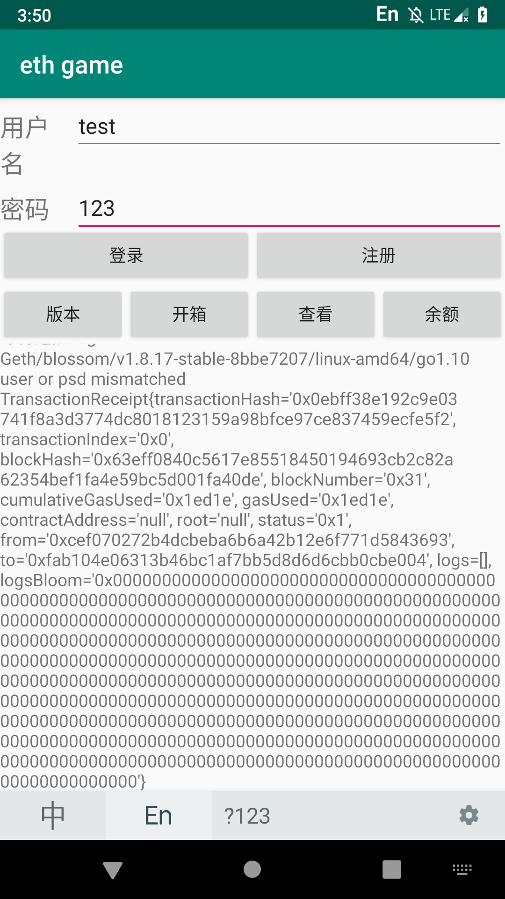

----------
## 区块链最终报告
----------

> Blockquote

### **选题背景**
 
区块链应用游戏领域的核心价值：把游戏权利交还给游戏玩家。
区块链的最大优势就是数据的安全问题，保证了数据的真实可靠，无法修改的特点。
去中心化、智能合约、资产买卖等技能特点，能很好的解决现在游戏职业游戏数据和用户数据隐私走漏的问题，促进游戏中虚拟数字钱银的保值，完成用户与游戏开发渠道公正的价值同享。

在国外，区块链技能已广泛应用在游戏钱银付出环节，如八百万玩家的游戏Fragoria已启动区块链付出网关，为游戏职业提供首个加密钱银付出计划。
本次项目正是基于这个特点，针对网络游戏数据容易被修改的问题出发，在android平台完成的一个小的功能。

----------

###**使用说明**

软件功能为基于区块链的开箱功能，也就是随机抽取道具，首先点击版本，会连接到本地的geth并获取contract实例，输入账号密码进行注册，注册完成以后就会储存在区块链中，每个操作都是基于以账号密码为依据进行操作的，每次开箱都会消耗钱包里的钱，获得一个道具，点击查看可以查看当前拥有的道具，余额可以查看以太坊钱包的余额。

----------

### **测试**

连接到geth获取contract实例

登录发现账户不存在

进行注册

登陆成功

查看余额

开箱

查看开出的道具

----------
#**代码部分**

> 首先启动geth开启rpc端口

    geth --identity "blossom"  --rpc  --rpccorsdomain "*" --datadir testNet --dev --port "30303"  --rpcapi "personal,db,eth,net,web3,miner"  --networkid 66666 --rpcport 8545 console 2>test.log

> 因为测试平台使用的是安卓的模拟器，所以我们不使用127.0.0.0这个地址而是使用下面的地址去获取web3j实例

    web3j = Web3j.build(new HttpService("http://10.0.2.2:8545"));

> 获取合约实例，这里的address为合约部署后返回的合约地址需要手动获取这里的合约类要通过solc、web3j命令行工具把sol合约文件编译成Java类，可参考[以太坊Web3j命令行生成Java版本的智能合约](https://www.jianshu.com/p/12775c49ef1b)

    mycontract = Mycontract.load(address,web3j,credentials,Mycontract.GAS_PRICE,Mycontract.GAS_LIMIT);

无论是部署合约或是获得合约实例，我们都要有一个钱包，消耗gas才能完成操作。第一个变量填入账户的密码，第二个变量填入账户文件的 path，在区块链文件夹下可以找到钱包的私钥文件

    credentials = WalletUtils.loadCredentials("", "/mnt/sdcard/Documents/keystore/UTC--2018-12-29T10-24-49.641797800Z--cef070272b4dcbeba6b6a42b12e6f771d5843693");

>  合约的调用函数

     public void login(View view) {

        try {
            final Boolean flag = mycontract.Login(user.getText().toString(), psd.getText().toString()).sendAsync().get();
            if (flag) {
                textview.setText(textview.getText().toString() + "Login succees!\n");
            }
            else  {
                textview.setText(textview.getText().toString() + "user or psd mismatched\n");
            }
        } catch (ExecutionException e) {
            e.printStackTrace();
        } catch (InterruptedException e) {
            e.printStackTrace();
        }

    }

    public void getBalance(View view) {
        EthGetBalance ethGetBalance = null;
        try {
            ethGetBalance = web3j.ethGetBalance("0xcef070272b4dcbeba6b6a42b12e6f771d5843693", DefaultBlockParameterName.LATEST).sendAsync().get();
        } catch (InterruptedException e) {
            e.printStackTrace();
        } catch (ExecutionException e) {
            e.printStackTrace();
        }

        if(ethGetBalance!=null){
            // 打印账户余额
            System.out.println(ethGetBalance.getBalance());
            // 将单位转为以太，方便查看
            System.out.println(Convert.fromWei(ethGetBalance.getBalance().toString(), Convert.Unit.ETHER));
            textview.setText(textview.getText().toString() + Convert.fromWei(ethGetBalance.getBalance().toString(), Convert.Unit.ETHER) + "\n");
        }
    }

    public void register(View view) {
        try {
            final TransactionReceipt transactionReceipt = mycontract.Register(user.getText().toString(), psd.getText().toString()).sendAsync().get();
            textview.setText(textview.getText().toString() + transactionReceipt.toString() + "\n");
        } catch (ExecutionException e) {
            e.printStackTrace();
        } catch (InterruptedException e) {
            e.printStackTrace();
        }
    }

    public void OpenCase(View view) {
        try {
            final TransactionReceipt transactionReceipt = mycontract.Opencase(user.getText().toString(), psd.getText().toString()).sendAsync().get();
            textview.setText(textview.getText().toString() + transactionReceipt.toString() + "\n");
        } catch (ExecutionException e) {
            e.printStackTrace();
        } catch (InterruptedException e) {
            e.printStackTrace();
        }
    }

    public void checkgun(View view) {
        try {
            final String s = mycontract.Getmygun(user.getText().toString(), psd.getText().toString()).sendAsync().get();
            textview.setText(textview.getText().toString() + s + "\n");
        } catch (ExecutionException e) {
            e.printStackTrace();
        } catch (InterruptedException e) {
            e.printStackTrace();
        }
    }

